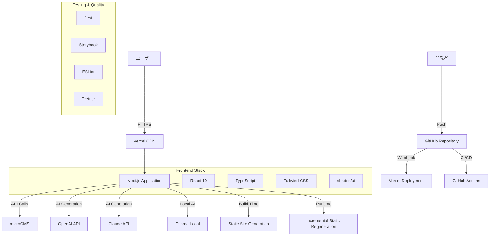
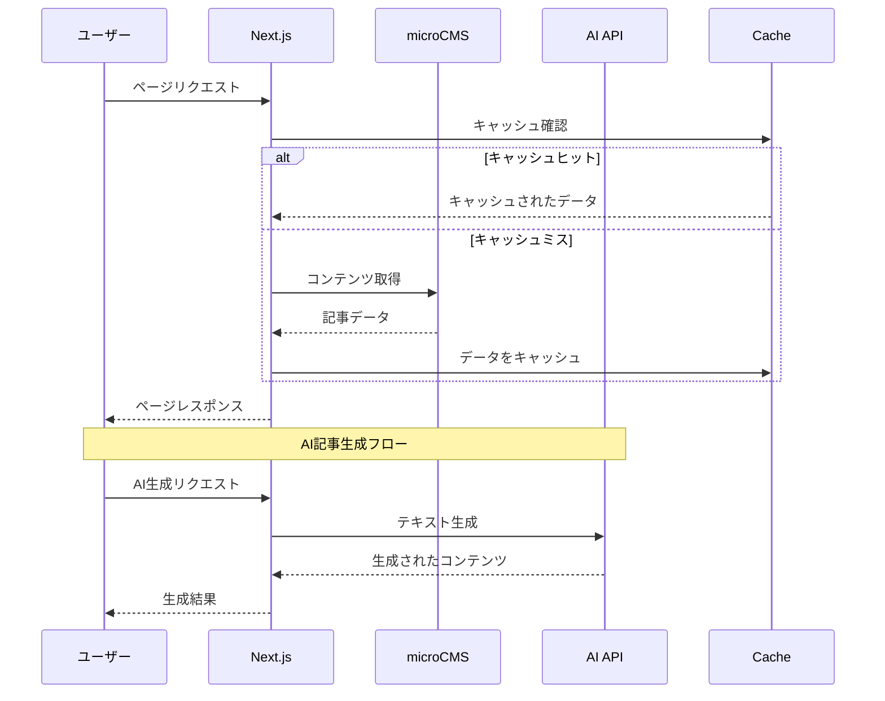
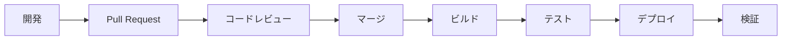

# システム構成書

## 1. システム全体構成

### 1.1 アーキテクチャ概要図



### 1.2 データフロー図



## 2. フロントエンド構成

### 2.1 Next.js App Router 構造

```
src/app/
├── layout.tsx                    # ルートレイアウト
├── page.tsx                      # ホームページ
├── globals.css                   # グローバルスタイル
├── loading.tsx                   # ローディング UI
├── error.tsx                     # エラー UI
├── not-found.tsx                 # 404 ページ
│
├── articles/                     # 記事関連ページ
│   ├── page.tsx                 # 記事一覧
│   ├── loading.tsx              # 記事一覧ローディング
│   ├── [slug]/                  # 記事詳細
│   │   ├── page.tsx             # 記事詳細ページ
│   │   └── loading.tsx          # 記事詳細ローディング
│   └── category/                # カテゴリ
│       └── [category]/
│           └── page.tsx         # カテゴリ別記事一覧
│
├── search/                      # 検索機能
│   └── page.tsx                 # 検索結果ページ
│
├── ai/                          # AI機能
│   └── generate/
│       └── page.tsx             # AI記事生成ページ
│
└── api/                         # API Routes
    ├── articles/
    │   └── route.ts             # 記事API
    ├── search/
    │   └── route.ts             # 検索API
    └── ai/
        ├── generate/
        │   └── route.ts         # AI生成API
        └── providers/
            └── route.ts         # AIプロバイダー管理
```

### 2.2 コンポーネント構成

```
src/components/
├── ui/                          # shadcn/ui ベースコンポーネント
│   ├── button.tsx
│   ├── input.tsx
│   ├── card.tsx
│   ├── badge.tsx
│   └── ...
│
├── layout/                      # レイアウトコンポーネント
│   ├── Header.tsx               # ヘッダー
│   ├── Footer.tsx               # フッター
│   ├── Navigation.tsx           # ナビゲーション
│   └── Sidebar.tsx              # サイドバー
│
├── article/                     # 記事関連コンポーネント
│   ├── ArticleCard.tsx          # 記事カード
│   ├── ArticleList.tsx          # 記事一覧
│   ├── ArticleDetail.tsx        # 記事詳細
│   ├── CategoryFilter.tsx       # カテゴリフィルター
│   ├── TagList.tsx              # タグ一覧
│   └── SearchForm.tsx           # 検索フォーム
│
├── ai/                          # AI機能コンポーネント
│   ├── AIGenerateForm.tsx       # AI生成フォーム
│   ├── ProviderSelector.tsx     # AIプロバイダー選択
│   ├── PromptTemplate.tsx       # プロンプトテンプレート
│   └── GenerationHistory.tsx    # 生成履歴
│
├── seo/                         # SEO関連コンポーネント
│   ├── MetaTags.tsx             # メタタグ
│   ├── StructuredData.tsx       # 構造化データ
│   └── Breadcrumb.tsx           # パンくずリスト
│
└── common/                      # 共通コンポーネント
    ├── LoadingSpinner.tsx       # ローディング
    ├── ErrorBoundary.tsx        # エラーバウンダリ
    ├── Pagination.tsx           # ページネーション
    └── Toast.tsx                # 通知
```

### 2.3 状態管理構成

```
src/
├── hooks/                       # カスタムフック
│   ├── useArticles.ts           # 記事データ取得
│   ├── useSearch.ts             # 検索機能
│   ├── useAI.ts                 # AI機能
│   └── useLocalStorage.ts       # ローカルストレージ
│
└── context/                     # React Context（状態管理）
    ├── AIContext.tsx            # AI設定・状態管理
    ├── ThemeContext.tsx         # テーマ設定管理
    └── SearchContext.tsx        # 検索状態管理
```

**状態管理戦略:**
- **useContext + useReducer**: 複雑な状態変更
- **useState**: シンプルな状態管理
- **カスタムフック**: ロジックの再利用
- **外部ライブラリ不使用**: 軽量で理解しやすい構成

## 3. バックエンド構成

### 3.1 API Routes 設計

```typescript
// API エンドポイント一覧
GET    /api/articles              # 記事一覧取得
GET    /api/articles/[slug]       # 記事詳細取得
GET    /api/articles/category/[category] # カテゴリ別記事取得
POST   /api/search               # 記事検索
POST   /api/ai/generate          # AI記事生成
GET    /api/ai/providers         # AIプロバイダー一覧
POST   /api/ai/providers         # AIプロバイダー設定
GET    /api/sitemap              # サイトマップ生成
GET    /api/feed                 # RSSフィード生成
```

### 3.2 データベース設計（microCMS）

```typescript
// 記事スキーマ
interface Article {
  id: string;
  title: string;
  content: string;
  excerpt?: string;
  slug: string;
  publishedAt: string;
  updatedAt: string;
  category: Category;
  tags: Tag[];
  featuredImage?: Image;
  seo: {
    metaTitle?: string;
    metaDescription?: string;
    ogImage?: Image;
  };
  author: Author;
  status: 'draft' | 'published';
}

// カテゴリスキーマ
interface Category {
  id: string;
  name: string;
  slug: string;
  description?: string;
  color?: string;
}

// タグスキーマ
interface Tag {
  id: string;
  name: string;
  slug: string;
}

// 著者スキーマ
interface Author {
  id: string;
  name: string;
  bio?: string;
  avatar?: Image;
  socialLinks?: {
    twitter?: string;
    github?: string;
  };
}
```

## 4. 外部サービス連携

### 4.1 microCMS 連携

```typescript
// microCMS クライアント設定
const client = createClient({
  serviceDomain: process.env.NEXT_PUBLIC_MICROCMS_SERVICE_DOMAIN,
  apiKey: process.env.MICROCMS_API_KEY,
});

// キャッシュ戦略
const CACHE_DURATIONS = {
  articles: 60 * 60, // 1時間
  categories: 60 * 60 * 24, // 24時間
  tags: 60 * 60 * 24, // 24時間
};
```

### 4.2 AI API 連携

```typescript
// AI プロバイダー抽象化
interface AIProvider {
  name: string;
  generateText(prompt: string, options: GenerateOptions): Promise<string>;
  validateApiKey(apiKey: string): Promise<boolean>;
}

// 対応プロバイダー
const providers: Record<string, AIProvider> = {
  openai: new OpenAIProvider(),
  claude: new ClaudeProvider(),
  ollama: new OllamaProvider(),
};
```

## 5. デプロイメント構成

### 5.1 Vercel 設定

```json
// vercel.json
{
  "buildCommand": "npm run build",
  "outputDirectory": ".next",
  "functions": {
    "src/app/api/**/*.ts": {
      "maxDuration": 30
    }
  },
  "headers": [
    {
      "source": "/(.*)",
      "headers": [
        {
          "key": "X-Content-Type-Options",
          "value": "nosniff"
        },
        {
          "key": "X-Frame-Options",
          "value": "DENY"
        }
      ]
    }
  ]
}
```

### 5.2 環境変数設定

```bash
# 必須環境変数
MICROCMS_API_KEY=                    # microCMS APIキー
NEXT_PUBLIC_MICROCMS_SERVICE_DOMAIN= # microCMS サービスドメイン
NEXT_PUBLIC_SITE_URL=               # サイトURL

# AI API設定（オプション）
OPENAI_API_KEY=                     # OpenAI APIキー
ANTHROPIC_API_KEY=                  # Claude APIキー

# 分析・監視
NEXT_PUBLIC_GA_ID=                  # Google Analytics ID
VERCEL_ANALYTICS_ID=               # Vercel Analytics ID
```

## 6. パフォーマンス最適化

### 6.1 レンダリング戦略

```typescript
// 静的生成（SSG）
export async function generateStaticParams() {
  const articles = await getArticles();
  return articles.map((article) => ({
    slug: article.slug,
  }));
}

// 増分静的再生成（ISR）
export const revalidate = 3600; // 1時間

// クライアントサイドレンダリング（CSR）
'use client';
```

### 6.2 キャッシュ戦略

```typescript
// Next.js キャッシュ設定
const fetchOptions = {
  next: {
    revalidate: 3600, // 1時間
    tags: ['articles'], // キャッシュタグ
  },
};

// SWR キャッシュ設定
const swrConfig = {
  revalidateOnFocus: false,
  revalidateOnReconnect: false,
  refreshInterval: 0,
};
```

### 6.3 画像最適化

```typescript
// Next.js Image コンポーネント
<Image
  src={article.featuredImage.url}
  alt={article.title}
  width={800}
  height={400}
  priority={index < 3} // 上位3件は優先読み込み
  placeholder="blur"
  blurDataURL="data:image/jpeg;base64,..."
/>
```

## 7. セキュリティ設計

### 7.1 認証・認可

```typescript
// API キー管理
interface APIKeyStore {
  provider: string;
  encryptedKey: string;
  userId: string;
  createdAt: Date;
}

// セッション管理（必要に応じて）
interface UserSession {
  id: string;
  settings: UserSettings;
  apiKeys: APIKeyStore[];
}
```

### 7.2 セキュリティヘッダー

```typescript
// Next.js セキュリティ設定
const securityHeaders = [
  {
    key: 'Content-Security-Policy',
    value: "default-src 'self'; script-src 'self' 'unsafe-eval';",
  },
  {
    key: 'X-Frame-Options',
    value: 'DENY',
  },
  {
    key: 'X-Content-Type-Options',
    value: 'nosniff',
  },
];
```

## 8. 監視・ログ

### 8.1 エラー監視

```typescript
// Error Boundary
class ErrorBoundary extends Component {
  static getDerivedStateFromError(error: Error) {
    return { hasError: true };
  }

  componentDidCatch(error: Error, errorInfo: ErrorInfo) {
    console.error('Error caught by boundary:', error, errorInfo);
    // エラー報告サービスに送信
  }
}
```

### 8.2 パフォーマンス監視

```typescript
// Web Vitals 計測
import { getCLS, getFID, getFCP, getLCP, getTTFB } from 'web-vitals';

function sendToAnalytics(metric: Metric) {
  // 分析サービスに送信
  gtag('event', metric.name, {
    value: Math.round(metric.value),
    event_label: metric.id,
  });
}

getCLS(sendToAnalytics);
getFID(sendToAnalytics);
getFCP(sendToAnalytics);
getLCP(sendToAnalytics);
getTTFB(sendToAnalytics);
```

## 9. CI/CD パイプライン

### 9.1 GitHub Actions ワークフロー

```yaml
# .github/workflows/ci.yml
name: CI
on: [push, pull_request]

jobs:
  test:
    runs-on: ubuntu-latest
    steps:
      - uses: actions/checkout@v4
      - uses: actions/setup-node@v4
        with:
          node-version: '18'
          cache: 'npm'
      
      - run: npm ci
      - run: npm run lint
      - run: npm run type-check
      - run: npm run test
      - run: npm run build
      
      - name: Upload coverage
        uses: codecov/codecov-action@v3
```

### 9.2 デプロイメントフロー



## 10. スケーラビリティ考慮事項

### 10.1 将来の拡張性

```typescript
// マイクロサービス対応
interface ServiceRegistry {
  articles: ArticleService;
  search: SearchService;
  ai: AIService;
  analytics: AnalyticsService;
}

// プラグインアーキテクチャ
interface Plugin {
  name: string;
  version: string;
  init(): Promise<void>;
  destroy(): Promise<void>;
}
```

### 10.2 パフォーマンススケーリング

- **Edge Computing**: Vercel Edge Functions 活用
- **CDN最適化**: 地域別キャッシュ戦略
- **Database最適化**: インデックス設計、クエリ最適化
- **API最適化**: GraphQL導入検討

この構成により、スケーラブルで保守性の高いSEOメディアプラットフォームを構築できます。